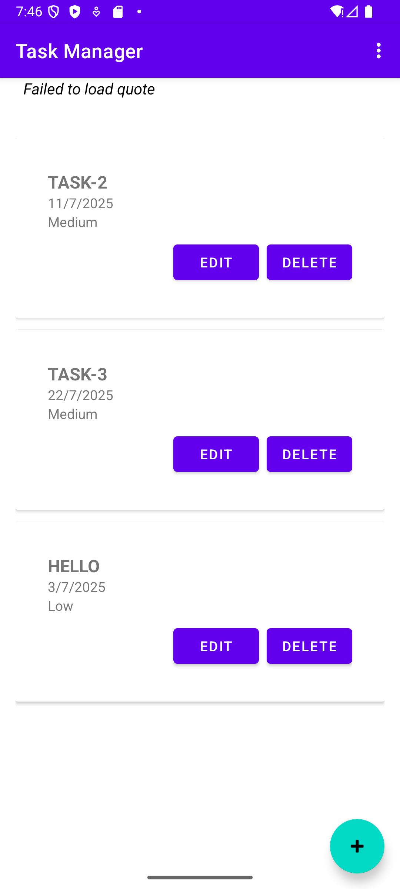
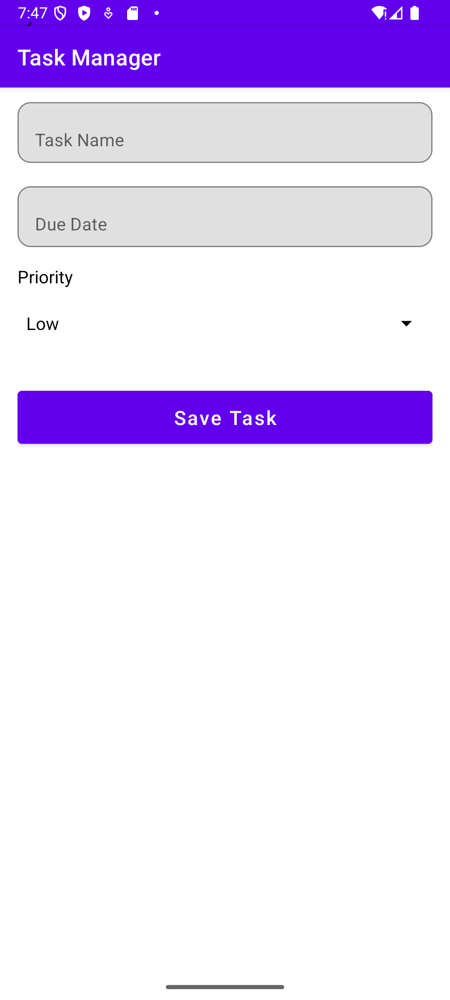
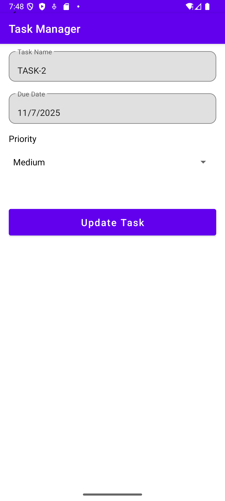

# Task Manager Android App

  
  


---

## Overview

**Task Manager** is a user-friendly Android application that helps users efficiently create, update, view, and delete their daily tasks. The app allows sorting tasks by due date or priority and supports light/dark theme toggling to suit user preferences. A motivational quote is fetched from an online API each time the task list is loaded to inspire users.

---

## Features

- **Add New Tasks:** Easily create tasks with a name, due date, and priority.
- **Edit Existing Tasks:** Modify task details anytime.
- **Delete Tasks:** Remove tasks via swipe or button.
- **Task List:** View all tasks with sorting by due date or priority.
- **Task Details:** View detailed information of each task.
- **Swipe to Delete:** Quick deletion gesture.
- **Theme Toggle:** Switch between light and dark mode.
- **Motivational Quotes:** Fetches random motivational quotes from an API.
- **Persistent Storage:** Uses SQLite database for local data storage.

---

## Screenshots

| Task List | Add Task | Edit Task | Task Details |
|-----------|----------|-----------|--------------|
|  |  |  |  |

---

## Technology Stack

- **Language:** Kotlin
- **Platform:** Android
- **Database:** SQLite (via SQLiteOpenHelper)
- **UI Components:** Material Design, RecyclerView, CardView, Spinner
- **API:** Quotable.io (for motivational quotes)

---

## Installation & Setup

1. **Clone the repository**

   ```bash
   git clone https://github.com/dhruvjivani/task-manager-android.git
   cd task-manager-android

Open with Android Studio

Open the project folder in Android Studio.

Let Gradle sync and build the project.

Run the App

Connect an Android device or use the emulator.

Click Run to launch the app.

Usage
Click the + button on the Task List screen to add a new task.

Tap the Edit button on any task to modify it.

Swipe left or right on a task to delete it quickly.

Use the menu options to sort tasks by date or priority.

Toggle between light and dark mode using the theme toggle option.

View motivational quotes via Toast notifications on the task list screen.

Code Highlights
Uses Kotlin's data classes for clean model definitions.

Implements RecyclerView with a custom adapter for smooth and flexible task lists.

SQLiteOpenHelper is used for persistent local storage with CRUD operations.

Material Design components enhance UI consistency and user experience.

Async network calls fetch motivational quotes without blocking the UI thread.

Future Enhancements
Add notifications/reminders for due tasks.

Support task categories or tags.

Implement user authentication for personalized task lists.

Offline caching for quotes and tasks.

Dark mode theme improvements and animations.

Contributing
Contributions are welcome! Feel free to submit issues and pull requests.

License
This project is licensed under the MIT License.

Contact
Dhruv Jivani
Email: dhruvjivani001@gmail.com
GitHub: https://github.com/dhruvjivani

Thank you for using Task Manager! Stay productive and motivated! 🚀

---

If you want, I can also help you generate a version with images or badges customized!
